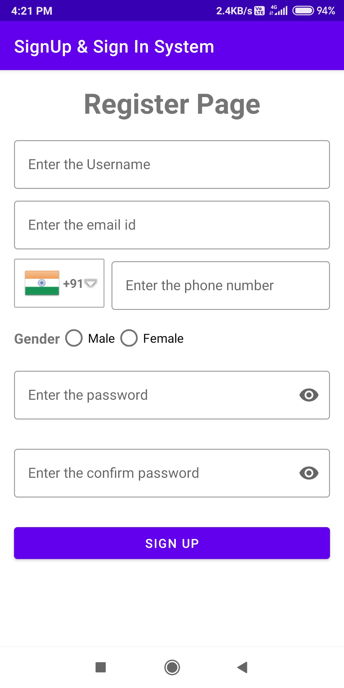
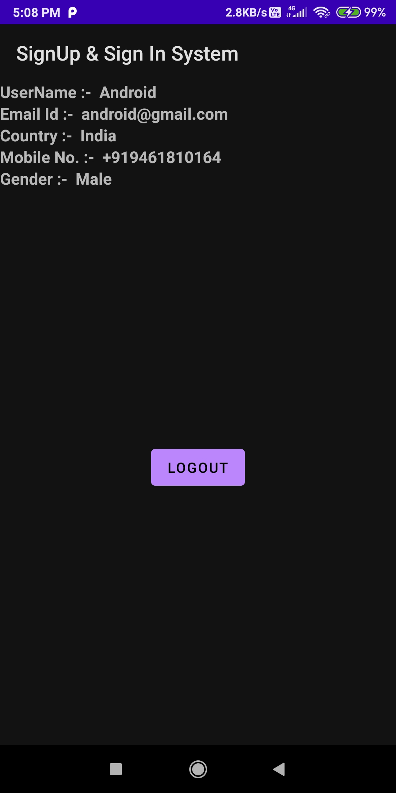

# SignUp-Sign-In-System
I have used authentication with proper validation at the starting of the app  using no libraries but only firebase library and also tried to reduce/optimise code.
# Screenshot
Light Mode:-

Dark Mode:-

